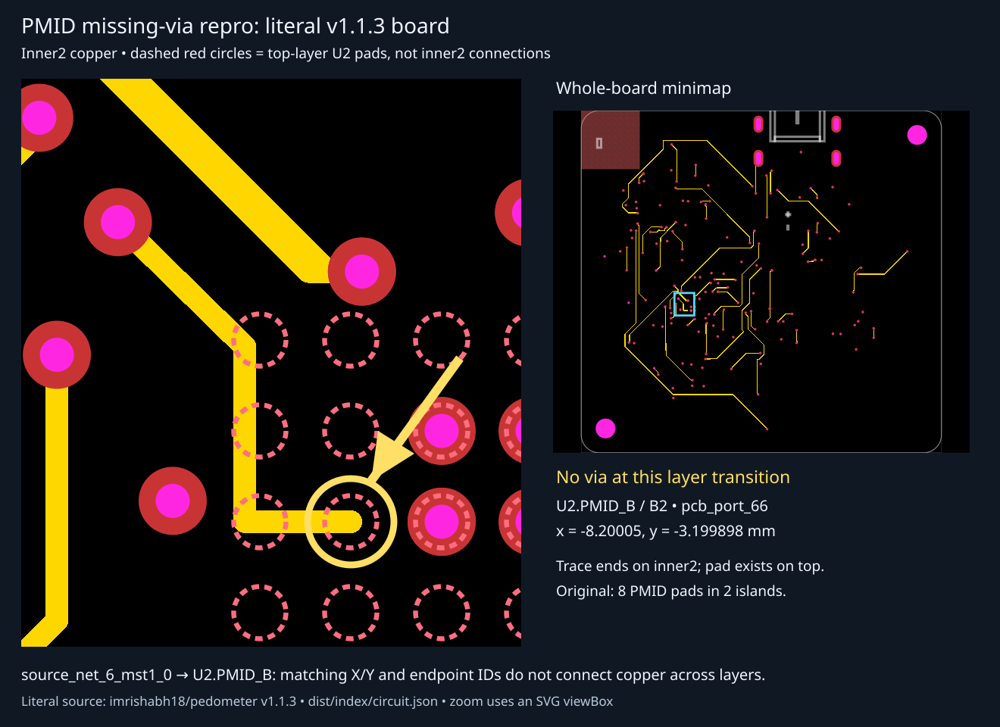
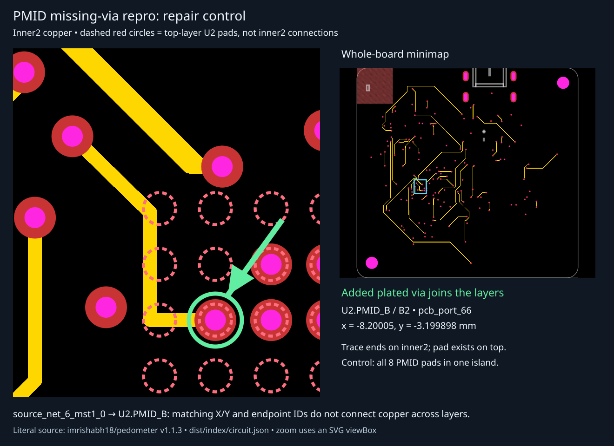

# Pedometer PMID open circuit: missing top ↔ inner2 via

The literal `imrishabh18/pedometer` v1.1.3 board passes the current short checker
on all four Gerber copper layers, but its PMID net has **two physically separate
islands**. A trace on `inner2` terminates at the XY coordinates of a top-only SMT
pad without a plated via. This is an **intra-net open**, not an inter-net short.

## Run

```sh
bun install
bun test tests/repros/pedometer/pedometer.test.ts
```

To intentionally regenerate the visual snapshots:

```sh
BUN_UPDATE_SNAPSHOTS=1 bun test tests/repros/pedometer/pedometer.test.ts
```

The test suite passes by asserting the observed defect, the shorts-only API's
blind spot, and positive/negative physical-connectivity controls. This PR is a
reproduction and test oracle; it does **not** add a production open-circuit API
or change `findBitmapShorts`'s contract.

## Literal fixture and provenance

- Published board: <https://tscircuit.com/imrishabh18/pedometer#pcb>
- Literal source: <https://tscircuit.com/imrishabh18/pedometer/blob/dist/index/circuit.json>
- Package release: `1c7b0745-f622-4f7d-8d72-542968f288fb`, version `1.1.3`.
- Retrieved 2026-09-24 from the page's `SSR_PACKAGE_FILE.content_text`.
- `pedometer.circuit.json`: **2,311,281 bytes**, **2,712 elements**.
- SHA-256: `64c56f80241a1bb502758ddbc92c6f0ed8e3fec9adc14cc2f6f0c47f90a2ce4f`.

The JSON is checked in verbatim, not synthesized, minimized, rerouted, rounded,
or rebuilt from TSX. A checksum test protects that property. The published
`review/circuit.json` is a separate artifact; it has the same defect but a
different checksum, so it is not substituted for the actual PCB-viewer input.
Repair controls append a via to a fresh in-memory array only.

## Exact defect

| Item | Literal JSON value |
| --- | --- |
| Net | `source_net_6`, `PMID` |
| Trace | `source_net_6_mst1_0` |
| Source trace | `source_trace_83` |
| Endpoint | `pcb_port_66`, U2 `PMID_B`, ball B2 |
| Endpoint coordinates | **x = -8.20005, y = -3.199898 mm** |
| Trace's final wire layer | **inner2** |
| Endpoint pad's layer | **top** |
| Missing copper | A plated layer transition at the endpoint |

The final wire even has `end_pcb_port_id: "pcb_port_66"`. That logical assertion
cannot electrically connect different layers. Both standalone `pcb_via`
elements and inline route-via records are checked; neither supplies a via within
0.2 mm of this endpoint.



The snapshot retains the full board geometry and zooms with a nested SVG
`viewBox`, with an arrow and whole-board minimap. Dashed red circles are explicitly
labelled **top-layer pad references**, not fabricated copper on inner2. The yellow
trace stops at U2.PMID_B without a drill/annulus. The repaired snapshot shows the
same location with an added via:



## Physical result and measurements

All eight PMID pads are probed; they fall into these two components:

| Physical island | Pads |
| --- | --- |
| Charger output | `C4.pin1`, `U2.PMID_A`, `U2.PMID_B` |
| Regulator/input branch | `C16.pin1`, `C9.pin1`, `U2.VINLS`, `U4.EN`, `U4.IN` |

Reported assembled-board measurements motivated the repro:

- C3 USB input: 5 V.
- C5 charger VDD: 1.8 V.
- C4 PMID: 5 V.
- C9 PMID: 0.22–0.24 V; C10 2.5 V rail: 0 V.
- C4's powered pad to C9's powered pad: `OL` with power disconnected.
- C4/C9 ground pads and USB housing: continuity.

The JSON independently reproduces this exact separation. It does not prove the
absence of additional manufacturing defects on the physical board.

## Why shorts did not catch it

`renderBitmapShortDebug` builds groups from the logical connectivity map and
rasterizes their copper per layer. It reports contact when pixels belong to
**different** connectivity keys. Separated pieces belonging to one key are not
shorts, and no cross-layer physical reachability check is performed. Consequently,
all four layer calls to `findBitmapShorts(..., { mode: "gerber" })` return `[]`
for this board. Zero shorts is not proof of continuity.

`physical-net-probe.ts` is a test-local continuity oracle:

1. Use metadata only to select copper and pads belonging to the expected net.
2. Render copper masks independently for top, inner1, inner2, and bottom.
3. Flood-fill physical copper islands with the same 8-neighbor contact convention
   used by the short checker.
4. Join islands between layers **only at explicit plated vias**, sampling their
   copper annuli rather than their drill centers and respecting their layer lists.
5. Probe every expected SMT pad and compare physical component membership.

Shared net names, `source_trace_id`, and `end_pcb_port_id` never create physical
edges. Thus the check verifies actual copper reachability rather than repeating
what the logical connectivity metadata claims.

## Controls and scope

- PCB masks at 50 px/mm and independently exported Gerber masks at 50 and
  100 px/mm all detect the same two pad groups.
- A single 0.30 mm / 0.15 mm plated via at the missing endpoint joins all eight
  pads into one group in both rendering modes.
- A via at the correct XY but spanning only inner2/bottom does not connect the
  top pad (PCB control).
- A remote via with the same logical connectivity key does not connect the pads
  (Gerber control).
- Original and repaired visual snapshots are compared on subsequent runs.

The oracle is deliberately scoped to this four-layer fixture's explicit vias
and centered SMT pads. It is not a general replacement for a production open
checker: plated through-hole terminals, inline-only vias, arbitrary layer stacks,
polygon-pad probe placement, isolated unassigned copper, and general net-tie
semantics need separate coverage before promotion. Bitmap resolution also bounds
the smallest detectable gap. A production check should enumerate every intended
net and report its disconnected physical pad groups, separately from shorts.

The added via is a **diagnostic control**, not a manufacturing-approved repair:
this repro does not evaluate its full clearance, drill, or assembly suitability.
